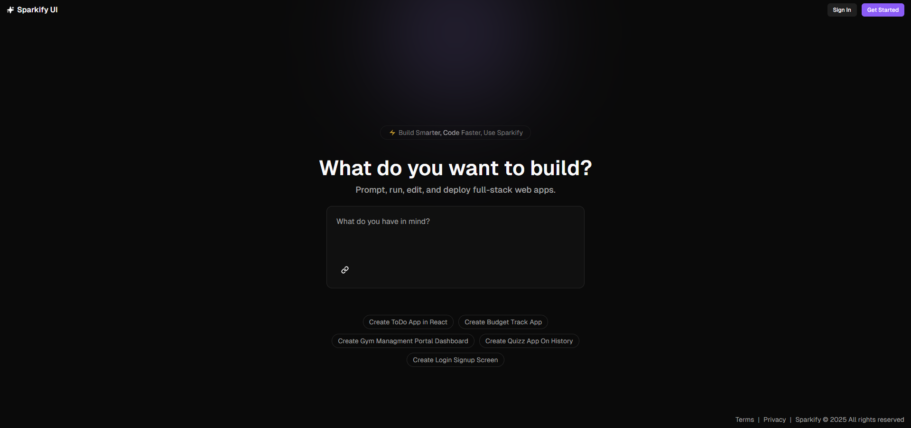

  
  
  
   &nbsp;
  

 
 

  

  <h1 align="center">Sparkify UI</h3>
  
Build UI components with the help of AI. Edit them with prompting and build faster. Try it out below...

  

     
    <a href="https://sparkify-demo.vercel.app/">View Demo</a> 
    &middot;
    <a href="https://sparkify-demo.vercel.app/">Report Bug</a>
    &middot;
    <a href="mailto:juanillaberia2002@gmail.com">Contact us</a>
  

## About The Project

Building UI components shouldn't be repetitive or time-consuming.  
With **Sparkify**, you can **leverage AI to generate UI components instantly**—speeding up development and letting you focus on creativity.  

 

## 🌟 Why Sparkify?  

🎨 **AI-Generated UI Components** – Describe, refine, and build UI effortlessly  
⚡ **Embrace automation and innovation** to speed up UI development like never before! 
🚀 **Fast & Efficient** – Get production-ready components in seconds  
💡 **Creative Control** – Customize AI-generated components to fit your design vision  

 

## 🚀 Get Started  

1️⃣ **Describe your UI component** in natural language  
2️⃣ **Let Sparkify generate a clean, responsive component**  
3️⃣ **Customize & refine the output** to match your design  
4️⃣ **Copy, use, and integrate effortlessly**  

> **💡 No more tedious UI coding. Just describe it and let AI build it.**  

 

## 📌 Features  

✅ **AI-Powered UI Generation** – Create beautiful, functional components instantly  
✅ **Customizable Outputs** – Edit, refine, and tweak components to perfection  
✅ **Responsive by Default** – AI ensures mobile-friendly and scalable designs  
✅ **Developer-Friendly** – Get clean, reusable code ready for integration  
✅ **Accelerate UI Development** – Turn ideas into reality in seconds  

 

## 🛠 Built With  

  
  
  
  

